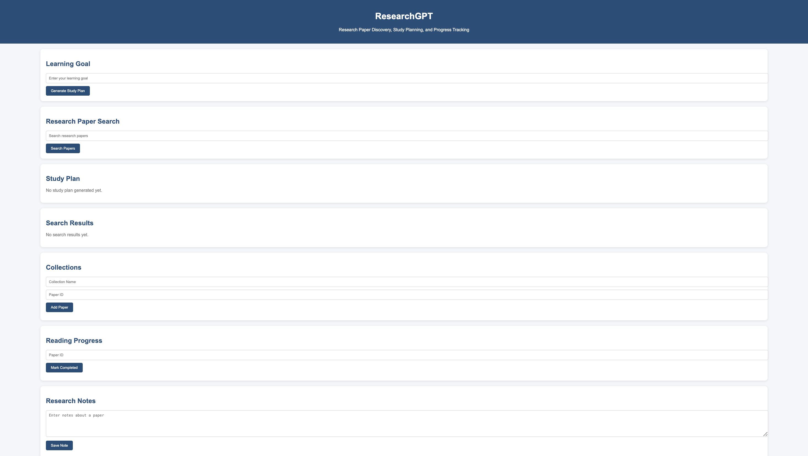
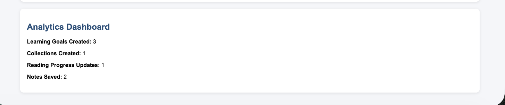
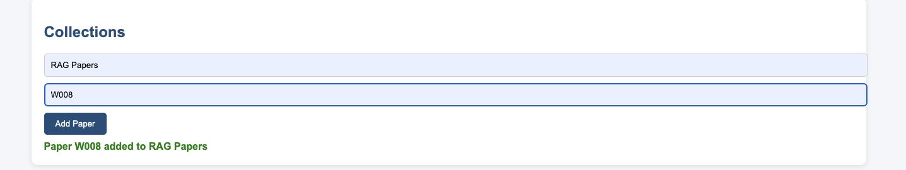
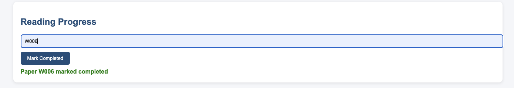
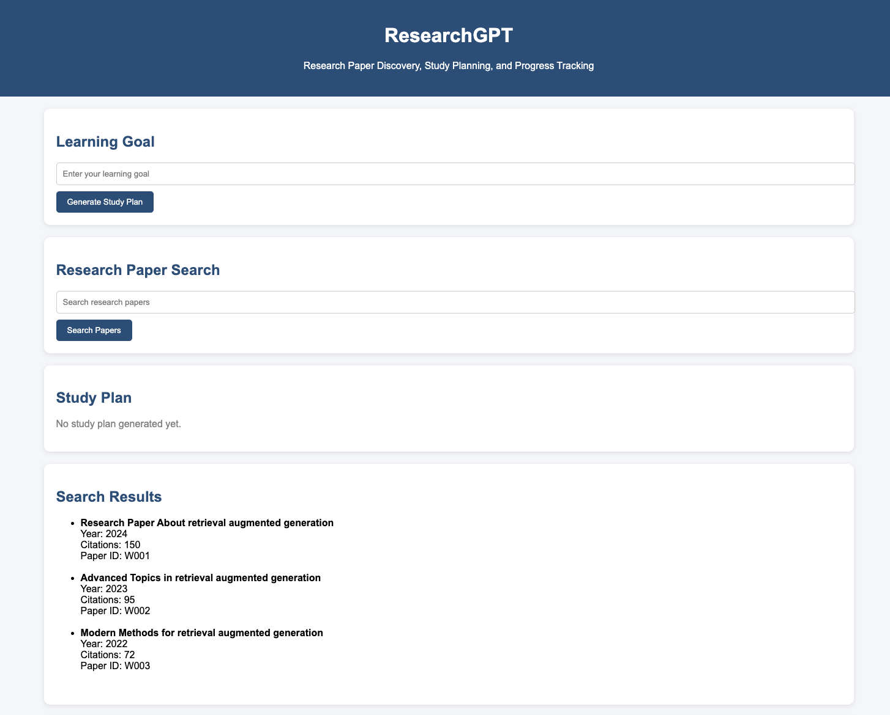
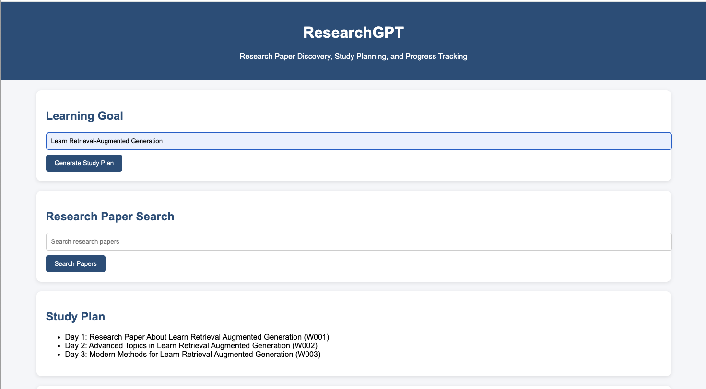

# ResearchGPT: AI Research and Learning Copilot

## Overview

ResearchGPT is an AI-powered research assistant built on Databricks. The goal of this project is to help users discover academic papers, organize research material, and create personalized learning plans.

The application uses the OpenAlex API to collect research paper data and stores the processed information in Delta tables. Paper abstracts are converted into embeddings and indexed using FAISS to support semantic search. An AI agent is used to retrieve relevant papers, generate study plans, manage collections, track progress, and save research notes.

This project demonstrates data engineering, vector search, retrieval-augmented generation (RAG), AI agents, Change Data Feed (CDF), and Databricks App deployment.

---

## Problem Statement

Researchers and students often spend a significant amount of time searching for relevant papers, organizing reading material, and planning their learning process.

ResearchGPT addresses this problem by providing:

- A centralized platform for research discovery
- Semantic search instead of basic keyword search
- Automated study plan generation
- Research collection management
- Progress tracking and note-taking
- AI-powered research assistance

---

## Project Architecture

```text
OpenAlex API
     |
     v
Spark ETL Pipeline
     |
     v
Delta Tables
     |
     v
Sentence Transformer Embeddings
     |
     v
FAISS Vector Index
     |
     v
AI Agent
     |
     v
Databricks App (Flask Frontend)
```

---

## Technologies Used

### Data Engineering

- Databricks Free Edition
- PySpark
- Spark SQL
- Delta Lake

### Data Source

- OpenAlex API

### Machine Learning

- Sentence Transformers
- all-MiniLM-L6-v2 Embedding Model

### Vector Search

- FAISS

### Frontend

- Databricks Apps
- Flask
- HTML/CSS

### Programming Language

- Python

---

## Database Design

The project uses the following tables:

### users

Stores user information.

| Column |
|----------|
| user_id |
| user_name |

### learning_goals

Stores learning objectives created by users.

| Column |
|----------|
| goal_id |
| user_id |
| goal_text |
| created_at |

### papers

Stores research paper information retrieved from OpenAlex.

| Column |
|----------|
| paper_id |
| title |
| abstract |
| publication_year |
| cited_by_count |

### authors

Stores author information.

| Column |
|----------|
| author_id |
| author_name |

### paper_authors

Stores the relationship between papers and authors.

| Column |
|----------|
| paper_id |
| author_id |

### collections

Stores user-created collections.

| Column |
|----------|
| collection_id |
| collection_name |

### collection_papers

Maps papers to collections.

| Column |
|----------|
| collection_id |
| paper_id |

### reading_progress

Tracks completed papers.

| Column |
|----------|
| paper_id |
| status |
| updated_at |

### notes

Stores notes created by users.

| Column |
|----------|
| note_id |
| paper_id |
| note_text |
| created_at |

### paper_embeddings

Stores persisted sentence-transformer embeddings.

| Column |
|----------|
| paper_id |
| embedding |

### activity_cdf

Stores Change Data Feed records used for analytics.

| Column |
|----------|
| note_id |
| paper_id |
| note_text |
| created_at |
| _change_type |
| _commit_version |
| _commit_timestamp |

---

## Data Pipeline

The data pipeline consists of the following steps:

1. Retrieve paper data from the OpenAlex API.
2. Process and clean the data using PySpark.
3. Extract paper metadata and author information.
4. Load the processed data into Delta tables.
5. Generate embeddings from paper abstracts.
6. Persist embeddings into Delta tables.
7. Build a FAISS index for semantic retrieval.
8. Enable Change Data Feed (CDF) for operational tables.
9. Generate analytics from CDF records.

---

## Semantic Search and RAG

Paper abstracts are treated as unstructured text.

Each abstract is converted into a vector embedding using the Sentence Transformer model:

```text
all-MiniLM-L6-v2
```

The embeddings are persisted in:

```text
researchgpt.paper_embeddings
```

The embeddings are indexed using FAISS.

When a user submits a search query, the query is converted into an embedding and compared against stored paper embeddings. The system retrieves papers based on semantic similarity rather than exact keyword matching.

### Example Query

```text
Beginner-friendly papers about retrieval evaluation
```

The system returns relevant papers even if the exact search terms do not appear in the paper title or abstract.

---

## AI Agent

The AI agent provides the main application functionality.

### Read Actions

#### Search Papers

Retrieves relevant papers using semantic search.

#### Generate Study Plans

Creates a reading sequence based on a user's learning goal.

### Write Actions

#### Save Learning Goals

Stores user learning objectives for future reference.

#### Add Papers to Collections

Allows users to organize papers into collections.

#### Track Progress

Marks papers as completed and records learning progress.

#### Save Notes

Stores notes linked to specific research papers.

The agent can both retrieve information and perform actions that update Delta tables.

---

## Change Data Feed (CDF)

Delta Change Data Feed (CDF) is enabled on operational tables to track user activity and support analytics.

### CDF-Enabled Tables

- learning_goals
- collections
- collection_papers
- reading_progress
- notes

CDF records are queried using:

```sql
table_changes()
```

and stored in:

```text
researchgpt.activity_cdf
```

for downstream analytics and reporting.

---

## Analytics

ResearchGPT generates analytics from user interactions captured in operational tables and CDF records.

Analytics include:

- Learning Goals Created
- Collections Created
- Reading Progress Updates
- Notes Saved

Analytics results are materialized in Delta tables and displayed through the application dashboard.

---

## Frontend Application

The application is deployed as a Databricks App using Flask.

The frontend allows users to:

- Create learning goals
- Search research papers
- Generate study plans
- Save papers to collections
- Track reading progress
- Store notes
- View analytics metrics

The frontend acts as the interaction layer between the user and the AI agent.

---

## Analytics Dashboard

The application includes an Analytics Dashboard displaying:

- Learning Goals Created
- Collections Created
- Reading Progress Updates
- Notes Saved

These metrics provide visibility into user research activity and platform usage.

---

## Project Workflow

### Step 1

The user enters a learning goal.

Example:

```text
Learn Retrieval-Augmented Generation
```

### Step 2

The AI agent retrieves relevant research papers using semantic search.

### Step 3

The user reviews the recommended papers.

### Step 4

A personalized study plan is generated.

### Step 5

Selected papers are saved to a collection.

### Step 6

The user tracks reading progress.

### Step 7

The user stores research notes.

### Step 8

Analytics summarize user activity.

---

## Project Structure

```text
ResearchGPT
│
├── 01_create_tables.py
├── 02_openalex_ingestion.py
├── 03_embeddings.py
├── 04_vector_search.py
├── 05_agent_tools.py
├── 06_enable_cdf.py
├── 07_research_agent.py
├── 08_cdf_analytics.py
│
├── app.py
├── research_tools.py
├── requirements.txt
│
├── README.md
├── .gitignore
```

---

## Setup Instructions

### Install Dependencies

```bash
pip install -r requirements.txt
```

### Configure API Key

Set the OpenAlex API key as an environment variable:

```bash
export OPENALEX_API_KEY=your_api_key
```

### Run Notebooks

Execute the notebooks in the following order:

```text
01_create_tables
02_openalex_ingestion
03_embeddings
04_vector_search
05_agent_tools
06_enable_cdf
07_research_agent
08_cdf_analytics
```

### Deploy the Application

Deploy the Flask frontend using Databricks Apps.

---

## Screenshots

### Home



### Analytics Dashboard



### Collection



### Reading Progress



### Search Results



### Study Plan



---

## Key Features

- OpenAlex API Integration
- Spark ETL Pipeline
- Delta Lake Storage
- Sentence Transformer Embeddings
- FAISS Semantic Search
- AI Agent Workflows
- Study Plan Generation
- Collection Management
- Reading Progress Tracking
- Research Notes
- Change Data Feed (CDF)
- Delta Analytics Tables
- Analytics Dashboard
- Databricks App Frontend

---

## Future Improvements

Some possible enhancements for future versions include:

- Research paper summarization using LLMs
- Multi-user support
- Personalized recommendations based on reading history
- Citation-aware question answering
- Research trend analysis
- Paper difficulty classification
- Persisted FAISS indexes
- Real-time analytics dashboards
- LLM-powered agent reasoning

---

## Conclusion

ResearchGPT successfully combines OpenAlex API ingestion, Spark ETL pipelines, Delta Lake storage, semantic search, FAISS vector retrieval, AI agent workflows, Change Data Feed analytics, and a Databricks App frontend into a complete research discovery and learning platform.
